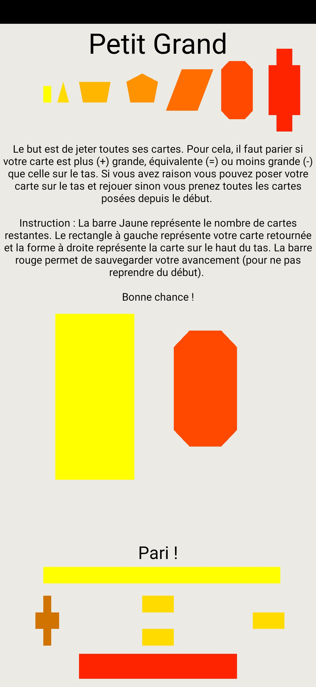
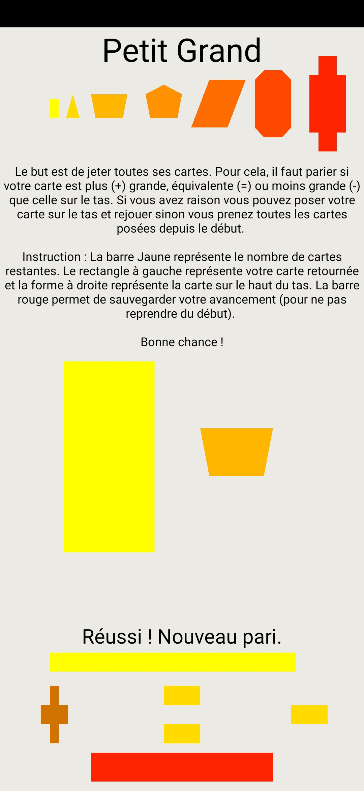
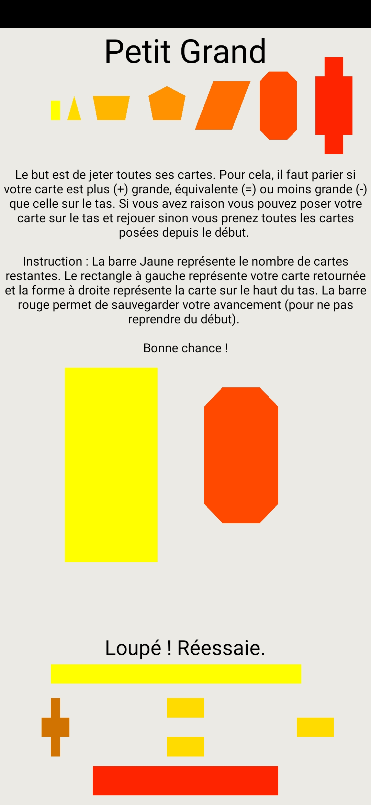
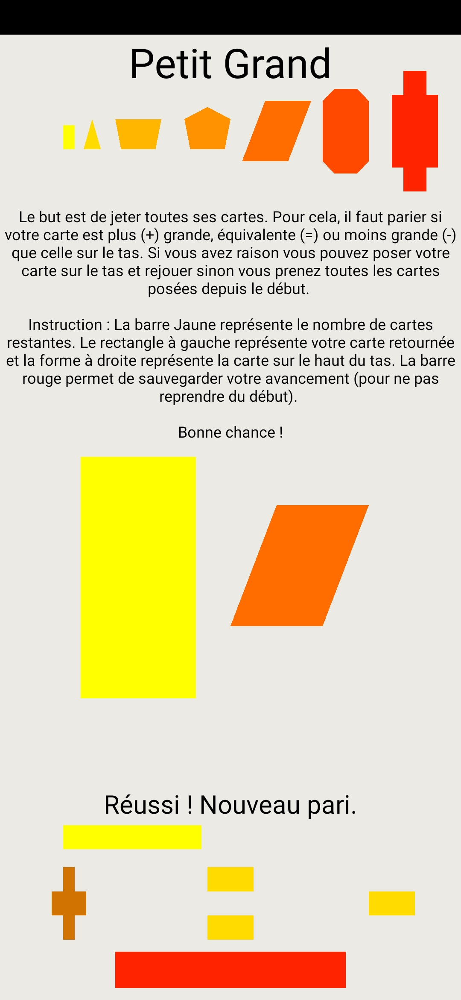
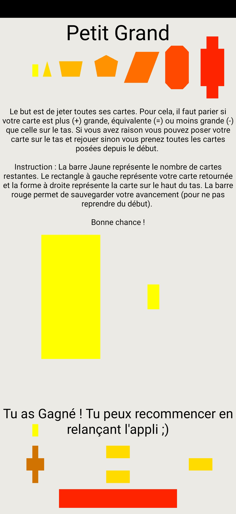

# Projet OPENGL

Le but du projet OPENGL est de recréer le jeu **Petit ou Grand**. Ce travail a été réalisé par **Jordan Ischard** ( o2161635 ).

## Travail réalisé

Les deux premières questions du projet ont été réalisé. Il manque donc la partie 2 joueurs. Je me suis permis de mettre le bouton *passer son tour* pour faciliter le jeu à 1 joueur (en clair, il sauvegarde le jeu en cours pour ne pas avoir à reprendre toutes les cartes du tas à chaque fois).

## Problèmes

Les plus grandes difficultés ont été de comprendre le mécanisme de mise à jour (ce qui est mise à jour principalement) d'OPENGL ainsi que son association avec les autres composants d'Android. Après cela et avec l'aide d'une base donnée par Mme Robert, le reste était abordable.

## Exemples

Au cas où, l'affichage ne soit pas bien sur votre appareil voici un ensemble de captures d'écrans prise sur le mien.

